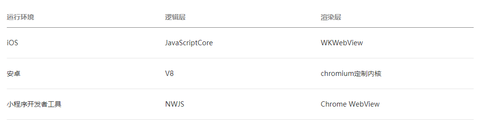
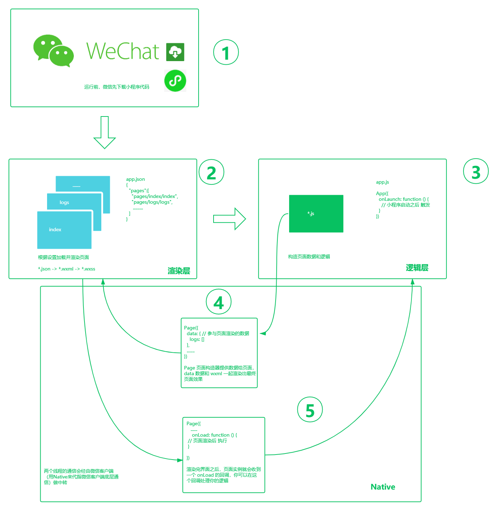

# 小程序开发原理概述

> 注：
>
> 此文初学者开不太懂很正常， 只需简单了解。等提升到一定层次后，转回头再看，会有豁然开朗的效果

## 1. 小程序与普通网页开发的区别

### 1.1 异同

* 相同：都是使用 js
* 不同：网页开发渲染线程和脚本线程是互斥的，这也是为什么长时间的脚本运行可能会导致页面失去响应，而在小程序中，二者是分开的，分别运行在不同的线程中。网页开发者可以使用到各种浏览器暴露出来的 DOM API，进行 DOM 选中和操作。而如上文所述，小程序的逻辑层和渲染层是分开的，逻辑层运行在 JSCore 中，并没有一个完整浏览器对象，因而缺少相关的DOM API和BOM API。这一区别导致了前端开发非常熟悉的一些库，例如 jQuery、 Zepto 等，在小程序中是无法运行的。同时 JSCore 的环境同 NodeJS 环境也是不尽相同，所以一些 NPM 的包在小程序中也是无法运行的。

### 1.2 小程序的运行环境



* 普通网页前端：操作系统+浏览器
* 微信小程序：移动操作系统（ios/android 等）+ 微信+ 小程序运行环境（类似浏览器，但不同，分为：逻辑层————跑js + 渲染层————管外观组件wxml）

## 2. 小程序的宿主环境（运行环境）

微信客户端给小程序所提供的环境为宿主环境，小程序借助宿主环境提供的能力，可以完成许多普通网页无法完成的功能。

### 2.1 渲染层和逻辑层

小程序的运行环境分成渲染层和逻辑层，其中 WXML 模板和 WXSS 样式工作在渲染层，JS 脚本工作在逻辑层。

小程序的渲染层和逻辑层分别由2个线程管理：渲染层的界面使用了WebView 进行渲染；逻辑层采用JsCore线程运行JS脚本。一个小程序存在多个界面，所以渲染层存在多个WebView线程，这两个线程的通信会经由微信客户端（下文中也会采用Native来代指微信客户端）做中转，逻辑层发送网络请求也经由Native转发，小程序的通信模型下图所示。


### 2.2 小程序运行逻辑




> 上面图形使用 ProcessOn 在线绘图工具制作，用 [ProcessOn注册链接](https://www.processon.com/i/596c79e7e4b043caf882475f) 注册，可以获取7天免费会员

## 3. 使用微信小程序组件

* 类似于前端框架中的控件，既包含类似于 html 标签的简单功能组件（如 block），也有功能强大的复杂功能组件(如 map)；
* 写在 wxml 中，用于构建小程序 UI


## 4. 使用微信小程序内置 API 

用于调用微信内部提供的功能，例如获取用户信息、微信支付等等。

一般为一个方法（函数），使用 wx 对象调用，wx.xxxxx();

``` js
// 微信扫一扫
wx.scanCode({
  success: (res) => {
    console.log(res)
  }
})

```

多数 API 的回调都是异步，需要处理好代码逻辑的异步问题。


> 参考资料：

> * [微信小程序官方文档](https://developers.weixin.qq.com/miniprogram/dev/framework/quickstart/framework.html#%E6%B8%B2%E6%9F%93%E5%B1%82%E5%92%8C%E9%80%BB%E8%BE%91%E5%B1%82)