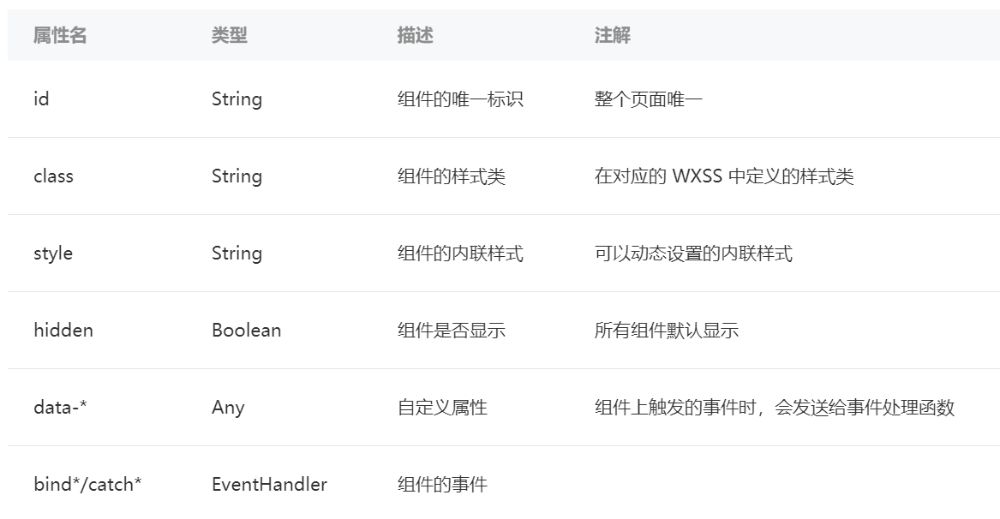

# wxml

## 1. 简介

WXML 全称是 WeiXin Markup Language，是小程序框架设计的一套标签语言，结合小程序的基础组件、事件系统，可以构建出页面的结构。

使用方式，完全类似 html

## 2. 属性

​标签可以拥有属性，属性提供了有关的 WXML元素更多信息。属性总是定义在开始标签中，除了一些特殊的属性外，其余属性的格式都是key="value" 的方式成对出现。需要注意的是，WXML中的属性是大小写敏感的

``` html
<!--一个带有属性的图片标签 -->
<image class="userinfo-avatar" src="./image/a.png" ></image>
```

## 3. 数据绑定

类似于 vue 等框架中的数据绑定方式，不是根据 dom 找到标签后，更改标签值，而是直接面向数据编程，将页面中定义好的数据用 {{ value }} 绑定到任意位置。

### 3.1 数据绑定到标签中

例子：在页面的 text 标签中绑定当前时间，并且每次编译时间都会被更新

``` html
<!--pages/wxml/index.wxml-->
<text>当前时间：{{time}}</text>
```

``` ts
Page({
  /**
   * 页面的初始数据
   */
  data: {
    time: (new Date()).toString()
  },
})
```
### 3.2 数据绑定到标签的属性中

属性值也可以动态的去改变，有所不同的是，属性值必须被包裹在双引号中，如下：

``` html
<!-- 正确的写法 -->
<text data-test="{{test}}"> hello world</text>


<!-- 错误的写法  -->
<text data-test={{test}}> hello world </text >
```

### 3.3 可以绑定表达式

可以在绑定中使用任意正确的表达式

### 3.4 条件逻辑

WXML 中，使用 wx:if="{{condition}}" 来判断是否需要渲染该代码块，使用 wx:elif 和 wx:else 来添加一个 else 块。

``` html
<view wx:if="{{length > 5}}"> 1 </view>
<view wx:elif="{{length > 2}}"> 2 </view>
<view wx:else> 3 </view>
```

因为 wx:if 是一个控制属性，需要将它添加到一个标签上。如果要一次性判断多个组件标签，可以使用一个 <block/> 标签将多个组件包装起来，并在上边使用 wx:if 控制属性。

``` html
<block wx:if="{{true}}">
  <view> view1 </view>
  <view> view2 </view>
</block>
```

### 3.5 列表渲染

#### 3.5.1 wx:for

在组件上使用 wx:for 控制属性绑定一个数组，即可使用数组中各项的数据重复渲染该组件。默认数组的当前项的下标变量名默认为 index，数组当前项的变量名默认为 item

``` html
<!-- array 是一个数组 -->
<view wx:for="{{array}}">
  {{index}}: {{item.message}}
</view>

<!-- 对应的脚本文件
Page({
  data: {
    array: [{
      message: 'foo',
    }, {
      message: 'bar'
    }]
  }
})
-->
```

使用 wx:for-item 指定数组当前元素的变量名，使用 wx:for-index 指定数组当前下标的变量名：

``` html
<view wx:for="{{array}}" wx:for-index="idx" wx:for-item="itemName">
  {{idx}}: {{itemName.message}}
</view>
```

类似 block wx:if ，也可以将 wx:for 用在 <block/> 标签上，以渲染一个包含多节点的结构块。例如：

``` html
<block wx:for="{{[1, 2, 3]}}">
  <view> {{index}}: </view>
  <view> {{item}} </view>
</block>
```

#### 3.5.2 wx:key

如果列表中项目的位置会动态改变或者有新的项目添加到列表中，并且希望列表中的项目保持自己的特征和状态（如 <input/> 中的输入内容， <switch/> 的选中状态），需要使用 wx:key 来指定列表中项目的唯一的标识符。

wx:key 的值以两种形式提供：

字符串，代表在 for 循环的 array 中 item 的某个 property，该 property 的值需要是列表中唯一的字符串或数字，且不能动态改变。

保留关键字 this 代表在 for 循环中的 item 本身，这种表示需要 item 本身是一个唯一的字符串或者数字。

``` html
<switch wx:for="{{objectArray}}" wx:key="unique" > {{item.id}} </switch>
<button bindtap="switch"> Switch </button>
<button bindtap="addToFront"> Add to the front </button>


<switch wx:for="{{numberArray}}" wx:key="*this" > {{item}} </switch>
<button bindtap="addNumberToFront"> Add Number to the front </button>
```

``` js
Page({
  data: {
    objectArray: [
      {id: 5, unique: 'unique_5'},
      {id: 4, unique: 'unique_4'},
      {id: 3, unique: 'unique_3'},
      {id: 2, unique: 'unique_2'},
      {id: 1, unique: 'unique_1'},
      {id: 0, unique: 'unique_0'},
    ],
    numberArray: [1, 2, 3, 4]
  },
  switch: function(e) {
    const length = this.data.objectArray.length
    for (let i = 0; i < length; ++i) {
      const x = Math.floor(Math.random() * length)
      const y = Math.floor(Math.random() * length)
      const temp = this.data.objectArray[x]
      this.data.objectArray[x] = this.data.objectArray[y]
      this.data.objectArray[y] = temp
    }
    this.setData({
      objectArray: this.data.objectArray
    })
  },
  addToFront: function(e) {
    const length = this.data.objectArray.length
    this.data.objectArray = [{id: length, unique: 'unique_' + length}].concat(this.data.objectArray)
    this.setData({
      objectArray: this.data.objectArray
    })
  },
  addNumberToFront: function(e){
    this.data.numberArray = [ this.data.numberArray.length + 1 ].concat(this.data.numberArray)
    this.setData({
      numberArray: this.data.numberArray
    })
  }
})
```

## 4. 模板

* WXML提供模板（template），可以在模板中定义代码片段，然后在不同的地方调用。使用 name 属性，作为模板的名字。然后在 <template/> 内定义代码片段
* 使用 is 属性，声明需要的使用的模板，然后将模板所需要的 data 传入;is 也可以动态决定具体需要渲染哪个模板

``` html
<!--
item: {
  index: 0,
  msg: 'this is a template',
  time: '2016-06-18'
}
-->


<template name="msgItem">
  <view>
    <text> {{index}}: {{msg}} </text>
    <text> Time: {{time}} </text>
  </view>
</template>


<template is="msgItem" data="{{...item}}"/>

<!-- 输出
0: this is a template Time: 2016-06-18
-->
```

## 5. 引用

WXML 提供两种文件引用方式import和include。

* import 可以在该文件中使用目标文件定义的 template。需要注意的是 import 有作用域的概念，即只会 import 目标文件中定义的 template，而不会 import 目标文件中 import 的 template，简言之就是 import 不具有递归的特性。
* include 可以将目标文件中除了 <template/> <wxs/> 外的整个代码引入，相当于是拷贝到 include 位置

## 6. 通用属性




> 注意：
>
> 1. 绑定的变量大小写敏感，也就是说 {{name}} 和 {{Name}} 是两个不同的变量。
> 2. 没有被定义的变量的或者是被设置为 undefined 的变量不会被同步到 wxml 中
> 3. 当数据改变触发渲染层重新渲染的时候，会校正带有 key 的组件，框架会确保他们被重新排序，而不是重新创建，以确保使组件保持自身的状态，并且提高列表渲染时的效率。

> 参考资料
>
> [小程序官方文档](https://developers.weixin.qq.com/ebook?action=get_post_info&docid=000ee2c29d4f805b0086a37a254c0a)